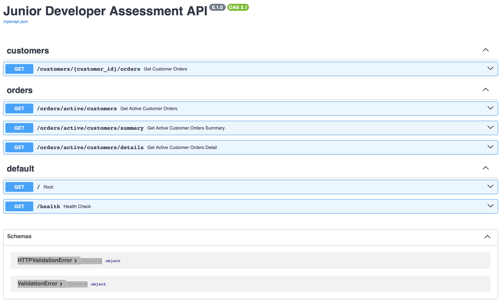
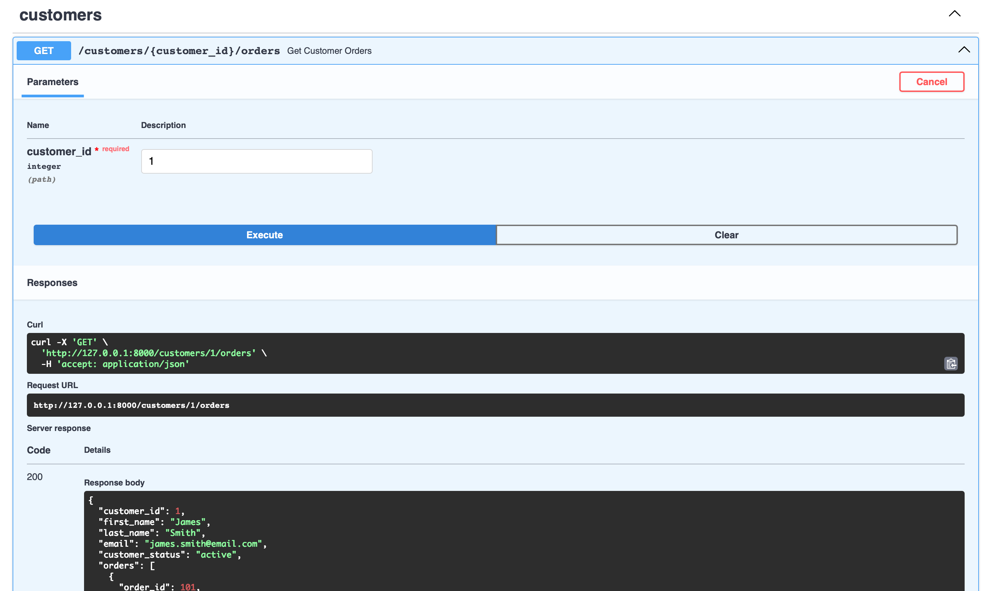
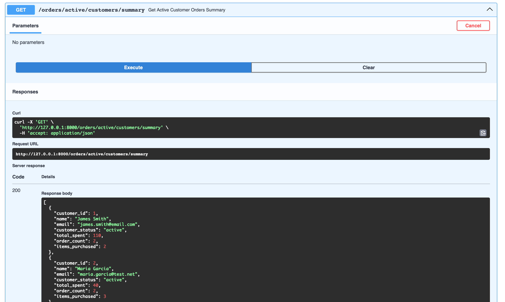

# UoS Junior Python Developer Assessment
This repository contains my submission for the University of Sheffield Junior Python Developer assessment.

This README contains:
- [UoS Junior Python Developer Assessment](#uos-junior-python-developer-assessment)
   * [Introduction](#introduction)
   * [Tasks](#tasks)
      + [Task 1 - Database Setup](#task-1---database-setup)
         - [Brief:](#brief)
            * [Data Requirements:](#data-requirements)
      + [Task 2 - REST API](#task-2---rest-api)
         - [Brief:](#brief-1)
      + [Task 3 - ETL Script](#task-3---etl-script)
         - [Brief:](#brief-2)
   * [Assumptions](#assumptions)
   * [How to Run the Application](#how-to-run-the-application)
      + [Setting up the Environment](#setting-up-the-environment)
         - [Create an virtual environment:](#create-an-virtual-environment)
         - [To Activate](#to-activate)
            * [Windows:](#windows)
            * [Mac or Linux:](#mac-or-linux)
         - [To Install Dependencies](#to-install-dependencies)
   * [To Start Running](#to-start-running)
      + [Folder Structure](#folder-structure)
      + [Setting Up the Database](#setting-up-the-database)
      + [Starting the API](#starting-the-api)
      + [Running the ETL script](#running-the-etl-script)
   * [My Choices](#my-choices)
      + [Technology Stack Selection:](#technology-stack-selection)
      + [Key Decisions & Thinking](#key-decisions--thinking)
         - [Architecture Planning & Designing](#architecture-planning--designing)
            * [Thinking:](#thinking)
         - [Reducing Round-Trips & Edge Cases](#reducing-round-trips--edge-cases)
            * [Thinking:](#thinking-1)
         - [ETL Logic to DB: ](#etl-logic-to-db)
            * [Thinking: ](#thinking-2)
         - [ETL to API Endpoint](#etl-to-api-endpoint)
            * [Thinking](#thinking-3)
         - [Refactoring](#refactoring)
            * [Thinking](#thinking-4)
   * [Application & Data Flow](#application--data-flow)
      + [Stage 1 - Sample Data to the Database](#stage-1---sample-data-to-the-database)
      + [Stage 2 - The API ](#stage-2---the-api)
         - [Example Result:](#example-result)
      + [Stage 3 - ETL Export Script](#stage-3---etl-export-script)
   * [What I Would Improve](#what-i-would-improve)
      + [Database Schema](#database-schema)
      + [Scalability & Security](#scalability--security)
         - [JWT Tokens](#jwt-tokens)
         - [Rate Limiting](#rate-limiting)
         - [Gateway Filtering](#gateway-filtering)

## Introduction
This assessment is designed to evaluate my core development and thinking skills
in a practical context. It includes three tasks followed by a written explanation of my
work. I have chose Python using 3 main libraries these are:
-  `FastAPI`
- `SQLite`
- `Pandas`

## Tasks

- Task 1 - Database Setup
- Task 2 - REST API
- Task 3 - ETL Script

### Task 1 - Database Setup

#### Brief:
> Write a script that creates tables in the database and the data (please refer to data
requirements section) is loaded into them.
The script should be repeatable so that running it again should not cause duplicates
or errors. You may use any database you are comfortable with.

##### Data Requirements:
> You are not provided with any data files. Part of this assessment is for you to create
your own sample data. Your data should represent a simple scenario involving
Customers and their Orders

> Guidelines:
> - You should have two datasets: Customers and Orders
> - Keep the data to a maximum of 50 rows per dataset.
> - Each Customer should have at least: a unique identifier, a first name, a surname, an email, and a status e.g., archived/active/suspended
> - Each Order should have at least: a unique identifier, a link to the customer who placed it, a product name, a quantity, and a unit price.
> - You are free to add any additional fields you think are useful.

### Task 2 - REST API
#### Brief:
> Build a simple API on the data you loaded in Task 1. The API should have an endpoint that returns Customer and Order data for a single Customer, looked up by their customer id.

### Task 3 - ETL Script
#### Brief:
> Write a standalone script that could be run on a schedule (for example, as a batch job or scheduled task). <br/> This script should query the database you created in Task 1 directly and carry out the following steps:
> - Extract - Query the database to retrieve all active customers along with their orders
> - Transform - Concatenate the first name and surname fields into a single name field. Calculate a total value for each order (quantity × unit price)
> - Export - Write the results to a CSV file saved in an output folder locally

## Assumptions
A few assumptions were made while implementing the solution:
- Orders belong to a single customer.
- Each order represents a single product purchase.
- Product information is stored directly on the order for simplicity.
- The dataset is intentionally small (≤50 rows) to match the brief.

## How to Run the Application
This was developed using Python `3.10`, due to the dependencies make sure you are running Python version `3.9`or later for a smooth experience. Also make sure `pip` is fully updated.

### Setting up the Environment

#### Create an virtual environment:
It's easier to contain and run these scripts off a virtual environment, to create one use this command in your terminal.
``` bash
> python -m venv env 
```

#### To Activate
##### Windows:
``` bash
> env\Scripts\activate
```
##### Mac or Linux:
```bash
% . env/bin/activate
```

#### To Install Dependencies
Depending on what version you have installed you may have to use `pip` or `pip3` but in this demonstration it will use `pip`
```bash
> pip install -r requirements.txt
```

## To Start Running

### Folder Structure
The folder structure will start out like this:
```bash
.
├── backend
│   ├── api
│   │   ├── customers.py
│   │   └── orders.py
│   ├── dal
│   │   ├── customers.py
│   │   └── orders.py
│   ├── main.py
│   ├── schemas
│   │   └── customer.py
│   └── services
│       ├── customer_service.py
│       └── orders_service.py
├── data
│   ├── customers.csv
│   └── orders.csv
├── db
│   └── connection.py
└── scripts
    ├── db_bootstrap.py
    └── export_script.py

```

Everything is separated that the API code lives in `./backend`, the database is separated and the standalone scripts live in their own folder. 

### Setting Up the Database
The database needs to be initialized first, so run the `db_bootstrap.py` file first this will create the database and import the data from `./data`. To run it from the _`root`_ directory:

```bash
> python -m scripts/db_bootstrap.py
```

### Starting the API

The API runs as a web service using `uvicorn`, it automatically updates from any changes and debugging is made easier. With `FastAPI` it creates it's own docs page at [`http://127.0.0.1:8000/docs`](http://127.0.0.1:8000) which allows you to test endpoints like Postman but it's built-in and lays out all your endpoints for you.

#### Example Photos of the Docs Page





To spin the server up use:
```bash
> uvicorn backend.main:app --reload
```

### Running the ETL script
To get the results from the ETL run `export_script.py` script from _`root`_:
```bash
> python ./scripts/export_script.py
```

The results will go to 2 timestamped files in `./output` as:
- `./output/customer_summary_<timestamp>.csv `
- `./output.orders_summary_<timestamp>.csv`


## My Choices
### Technology Stack Selection:
* **FastAPI & Uvicorn**: I chose `FastAPI` over alternatives like `Flask` for its modern, asynchronous capabilities and native integration with `Pydantic` for data validation. Since I was under the assumption the team is moving towards `FastAPI`, it ensures the solution is aligned with your future technical direction. `Uvicorn` was used as the `ASGI` server because it integrates well with `FastAPI` and provides good performance for asynchronous APIs.
- **SQLite**: For the requirements of this project, `SQLite` is the ideal choice. It is lightweight, requires zero configuration, and is built in `C,` providing high-speed performance for embedded applications. Its native integration with `Python's` `sqlite3` module and `Pandas `makes it a robust "single-source-of-truth" for this assessment without the overhead of a managed database server.
- **Pandas**: `Pandas` simplifies tabular transformations and `CSV `export. While the same logic could be implemented using raw SQL and the csv module, `Pandas` provides clearer transformation steps for the ETL process

### Key Decisions & Thinking
#### Architecture Planning & Designing
I made the decision to start out by planning and creating an ERD and API documentation. 
##### Thinking:
I believe that a "design-first" approach makes a project easier to program, debug, and explain. It's what I was taught and part of the job. Planning ahead gives you a strong foundation and causes less oversight as you program. It also allows you to define your scope better, and create a better understanding of the project.

#### Reducing Round-Trips & Edge Cases
I made the decision to use a `LEFT JOIN` for getting the orders of "active" customers. 
##### Thinking:
The decision to use a `LEFT JOIN` removes the use for multiple queries, on bigger datasets and on more critical systems, this can be a major breaking point, going back and forth to the database is computational and bandwidth overload. Additionally using a `LEFT JOIN` instead of an `INNER JOIN` means any active users, who have 0 orders show up on the report to or else the `NULLs` would of hidden them records.

#### ETL Logic to DB: 
I made the decision to implement the `order_total` as a Generated Column in the `SQLite` schema, filtering active customers in a query, and concatenating the name in a single query.

##### Thinking: 
It is always more efficient to "filter early" at the database level. This reduces the memory footprint of the `Python` environment and minimizes the amount of data being transferred between the DB and the application.
The `order_total` column is defined as a generated column so the value is always derived from _`quantity × unit_price`_. This avoids duplication of calculation logic across the API and ETL script.

#### ETL to API Endpoint
I decided to implement the ETL feature in to the API with 3 new endpoints for 3 ways to consume and transform the data. 
##### Thinking
Although in the brief it was mentioned that the ETL script is to query the database _**directly**_ and export it to a CSV, I recognized that while a CSV is excellent for flat data storage, it cannot cleanly represent the "One-to-Many" relationship between a customer and their orders.By offering a nested JSON response for the detailed view, I'm giving the consumer a choice. They can ingest a lightweight summary for quick lists, or "opt-in" to the full nested history. This structure is much easier for a frontend developer to map over and eliminates the need for them to write their own grouping logic

#### Refactoring
My final decision was a refactor after I created everything.
##### Thinking
Mid-way through development, I recognized that my initial project structure did not align with `FastAPI` best practices. I made the conscious decision to refactor the codebase/ I separated schemas from business logic and properly managing the database connection lifecycle. This ensures the final submission and the final merge to main was not just functional, but maintainable and professional. 

It also means my code follows standards and protocols for Python scripts and APIs.

## Application & Data Flow

### Stage 1 - Sample Data to the Database
To ensure the application is scalable, the bootstrap process uses a Python Generator to ingest raw `.csv` data. By reading the file into a `dictionary` and using `yield` to stream rows as `Tuples`, the system creates a "conveyor belt" effect. This allows the database to be populated efficiently without loading the entire dataset into memory, protecting the application from memory overflows as the data scales.

### Stage 2 - The API 
The API acts as a bridge and a gateway from a frontend to the raw database rows. 

The API uses a data access layer, this contains the SQL and the fetch commands, the API requests a specific data request using the relevant service, the data access layer then connects with the database and gets the relevant data with the relevant SQL. With a DAL you can separate each entity up and the queries relevant to said entity. Depending on what is querying the database. 

Luckily `FastAPI` allows for splitting this up with custom routes. I split the API endpoints into `/customers/{customer_id}/orders` this is because it is under the customers domain. This is separated that when getting my additional scope to it `/orders/active/customers` gets all the active customers orders, it is sending back order data.

#### Example Result:
```bash
GET /customers/1/orders
```
```json
{
  "customer_id": 1,
  "first_name": "James",
  "last_name": "Smith",
  "email": "james.smith@email.com",
  "customer_status": "active",
  "orders": [
    {
      "order_id": 101,
      "product": "Wireless Mouse",
      "quantity": 1,
      "unit_price": 25,
      "order_date": "2026-03-10"
    },
    {
      "order_id": 102,
      "product": "Mechanical Keyboard",
      "quantity": 1,
      "unit_price": 85,
      "order_date": "2026-02-15"
    }
  ]
}
```

### Stage 3 - ETL Export Script
Now here the script accesses the database directly, like requested in the brief. It uses the same query that the API endpoint does. It reads the SQL with `Pandas` to return it into a `DataFrame`. It is then aggregated per customer and returned and output as `.csv` 

## What I Would Improve
### Database Schema
I would most definitely split the schema up so that products are held in their own relative table. This helps scaling and accountability over values and data. However this removes the generated column in `Orders`. However there are ways around it like `TRIGGER` or a `VIEW`, still giving these calculations to the DB Engine, making it quicker. It also allows the database to scale easier and query quicker and easier. 

### Scalability & Security
If this was in production, the API would very much need authentication using JWT tokens, rate limiting and gateway filtering. 

#### JWT Tokens
JWT Tokens are JSON Web Tokens which are signed by the API to authenticate the user and their requests. Using a direct script to access the DB removes the need for using the API for such calculations but anyone or any other application using the API means it is restricted.

#### Rate Limiting
Rate limiting allows users with tokens and IP addresses to be limited on how many times they can access the API and call endpoints, so that the API has abuse protections

#### Gateway Filtering
This is to protect the API from interference from outside connections are from accepted and secure connections. It can also stop the database being accessed if someone was to gain access to the host PC. 
