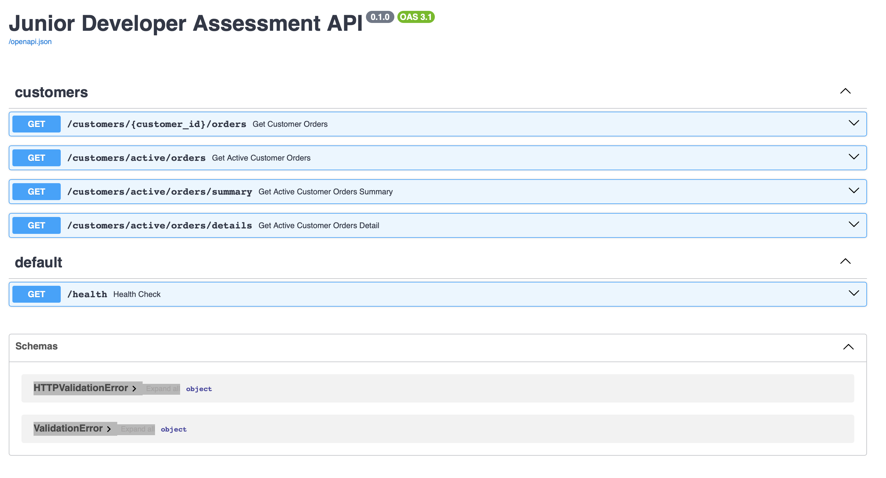

# UoS Junior Python Developer Assessment
This repository is for my application to the University of Sheffield junior python developer role. I have been given 3 tasks to develop on and this repository holds my solutions to the tasks given.

This README contains:

## Introduction
This assessment is designed to evaluate my core development and thinking skills
in a practical context. It includes three tasks followed by a written explanation of my
work. I have chose Python using 3 main libraries these are:
-  `FastAPI`
- `SQLite`
- `Pandas`

## Tasks

- Task 1 - Database Setup
- Task 2 - REST API
- Task 3 - ETL Script

### Task 1 - Database Setup

#### Brief:
> Write a script that creates tables in the database and the data (please refer to data
requirements section) is loaded into them.
The script should be repeatable so that running it again should not cause duplicates
or errors. You may use any database you are comfortable with.

##### Data Requirements:
> You are not provided with any data files. Part of this assessment is for you to create
your own sample data. Your data should represent a simple scenario involving
Customers and their Orders

> Guidelines:
> - You should have two datasets: Customers and Orders
> - Keep the data to a maximum of 50 rows per dataset.
> - Each Customer should have at least: a unique identifier, a first name, a surname, an email, and a status e.g., archived/active/suspended
> - Each Order should have at least: a unique identifier, a link to the customer who placed it, a product name, a quantity, and a unit price.
> - You are free to add any additional fields you think are useful.

### Task 2 - REST API
> Build a simple API on the data you loaded in Task 1. The API should have an endpoint that returns Customer and Order data for a single Customer, looked up by their customer id.

### Task 3 - ETL Script
> Write a standalone script that could be run on a schedule (for example, as a batch job or scheduled task). This script should query the database you created in Task 1 directly and carry out the following steps:
> - Extract - Query the database to retrieve all active customers along with their orders
> - Transform - Concatenate the first name and surname fields into a single name field. Calculate a total value for each order (quantity × unit price)
> - Export - Write the results to a CSV file saved in an output folder locally

## How to Run the Application
This was developed using Python `3.10`, due to the dependencies make sure you are running Python version `3.9`or later for a smooth experience. 

Also make sure `pip` is fully updated.

### Setting up the Environment

#### Create an virtual environment:
It's easier to contain and run these scripts off a virtual environment, to create one use this command in your terminal.
``` bash
> python -m venv env 
```

#### To Activate
##### Windows:
``` bash
> env\Scripts\activate
```
##### Mac or Linux:
```bash
% . env/bin/activate
```

#### To Install Dependencies
Depending on what version you have installed you may have to use `pip` or `pip3` but in this demonstration it will use `pip`
```bash
> pip install -r requirements.txt
```

## To Start Running

### Folder Structure
The folder structure will start out like this:
```bash
.
├── backend
│   ├── api
│   │   └── customers.py
│   ├── dal
│   │   └── customers.py
│   ├── main.py
│   ├── schemas
│   │   └── customer.py
│   └── services
│       └── customer_service.py
├── data
│   ├── customers.csv
│   └── orders.csv
├── db
│   └── connection.py
└── scripts
    ├── db_bootstrap.py
    └── export_script.py
```

Everything is separated that the API code lives in backend, the database is separated and the standalone scripts live in their own folder. 

### Setting Up the Database
The database needs to be initialized first, so run the `db_bootstrap.py` file first this will create the database and import the data from `./data`. To run it from the _`root`_ directory:

```python
python Scripts/db_bootstrap.py
```

### Starting the API

The API runs as a web service using `uvicorn`, it automatically updates from any changes and debugging is made easier. With `FastAPI` it creates it's own docs page at `http://127.0.0.1:8000/docs` which allows you to test endpoints like Postman but it's built-in and lays out all your endpoints for you.



To spin the server up use:
```bash
uvicorn backend.main:app --reload
```

### Running the ETL script
To get the results from the ETL script from root:
```bash
python .