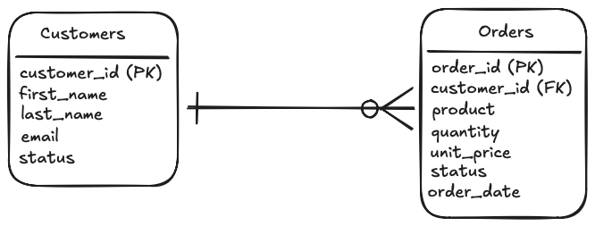

# Database Schema
*This document describes the database schema used in the project.*


The project uses a SQLite relational database to store customer and order data imported from CSV datasets.

The database is created and populated using the bootstrap script:
>scripts/db_bootstrap.py

The resulting database file is stored at:
> db/app.db


## Database Overview
The database consists of two related tables:
* customers
* orders

These tables are linked through a foreign key relationship.

Relationship model:


>A single customer can place multiple orders, but each order belongs to one customer

## Table Definitions
### customers
Stores customer information imported from `customers.csv`.

| Column | Type | Description |
|---|---|---|
| customer_id | INTEGER | Primary Key |
| first_name | TEXT | Customer first name |
| last_name | TEXT | Customer last name |
| email | TEXT | Customer email address |
| status | TEXT CHECK(status IN( 'active','archived','inactive')) | An enum for the status of the customers account |

### orders
Stores order information imported from `orders.csv`

| Column | Type | Description |
|---|---|---|
| order_id | INTEGER | Primary Key |
| customer_id | INTEGER  | Foreign key of customer id |
| product | TEXT | Product name |
| quantity | INTEGER | Amount of the product ordered |
| unit_price | REAL | Cost per product |
| status | TEXT CHECK( status IN("Pending", "Shipped", "Delivered", "Cancelled")) | An ENUM to quickly view/change the status of the order |
| order_date | TEXT [YYYY-MM-DD] | To see when the order was placed |

The use of primary and foreign keys forces relational integrity between customers and their orders.

## SQL Schema
The following SQL statements define the schema used in the database bootstrap process.

### Create customers table
```sql
CREATE TABLE IF NOT EXISTS Customers (
    customer_id INTEGER PRIMARY KEY,
    first_name TEXT NOT NULL,
    last_name TEXT NOT NULL,
    email TEXT NOT NULL UNIQUE,
    status TEXT NOT NULL CHECK (status IN ('active', 'archived', 'inactive'))
);
```

### Create orders table
```sql
CREATE TABLE IF NOT EXISTS Orders (
    order_id INTEGER PRIMARY KEY,
    customer_id INTEGER NOT NULL,
    product TEXT NOT NULL,
    quantity INTEGER NOT NULL CHECK (quantity > 0),
    unit_price REAL NOT NULL CHECK (unit_price >= 0),
    status TEXT NOT NULL CHECK (status IN ('Pending', 'Shipped', 'Delivered', 'Cancelled')),
    order_date TEXT NOT NULL, -- Format: YYYY-MM-DD
    FOREIGN KEY (customer_id) REFERENCES Customers(customer_id)
);
```

## Data Sources
The tables are populated from CSV datasets located in `./data/` 
Files:
> ./data/customers.csv

>./data/orders.csv 

## Example Query
The following query retrieves a customer and all associated orders.
```sql
SELECT
    c.customer_id,
    c.first_name,
    c.last_name,
    o.product,
    o.quantity,
    o.unit_price,
FROM customers c
JOIN orders o
ON c.customer_id = o.customer_id
WHERE c.customer_id = 1 AND c.status = 'active';
```

This type of query is used by the API to return customer order data.

## ETL Usage
The ETL process combines data from both tables to generate an export dataset.
Transformations include:
* combining first_name and last_name into full_name
* calculating order_total (quantity x unit_price)
* filtering only active customers

Example transformation query:
```sql
SELECT 
    (c.first_name || ' ' || c.last_name) AS name, 
    o.product,
    o.quantity,
    o.unit_price,
    (o.quantity * o.unit_price) AS total_value 
FROM customers c
JOIN orders o ON c.customer_id = o.customer_id
WHERE c.status = 'active'; 
```